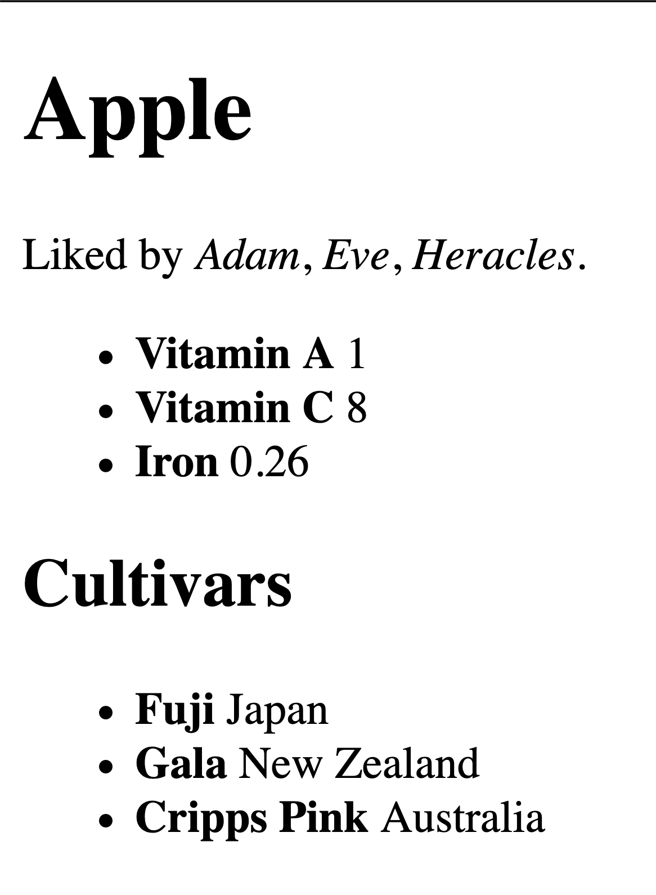

```{r, include=FALSE}
source("start.R")

food <- read_csv(file.path("data", "food.csv"))
food_prices <- read_csv(file.path("data", "food_prices.csv"))
```


# HTML and XML

## XML Format

XML (Extensible Markup Language) is a popular format for transfering
and storing data. As with JSON data, the format is quite flexible and
typically results in nested, tree-like structures that require some
work to turn into a rectangular data format. Much of the formal
standards for XML are concerned with describing how other groups can
produce specific "extensible" dialects of XML that have consistent
names and structures to describe particular kinds of data. Popular
open examples include XML-RDF (Resource Description Framework) for describing
linked open data and XML-TEI (Text Encoding Initiative) for providing
context to textual data.

In short, XML organizes data inside of hierarchically nested tags. Tags
start with the `<` sign and end with the `>` sign. A start-tag such as
`<section>` is closed by a corresponding end-tag with a slash after the
`<`, such as `</section>`.  Tags can additionally have an arbiratry number
of name-value pairs called attributes.

Here is an example of one way the apple data that was stored in JSON in
the previous chapter could be stored as an XML file.

```
<?xml version="1.0" encoding="UTF-8"?>
<root>
  <food>
    <name>Apple</name>
    <nutrition>
      <item name="Vitamin A">1</item>
      <item name="Vitamin C">8</item>
      <item name="Iron">0.26</item>
    </nutrition>
    <likes>
      <person>Adam</person>
      <person>Eve</person>
      <person>Heracles</person>
    </likes>
    <cultivars>
      <cultivar name="Fuji" location="Japan"></cultivar>
      <cultivar name="Gala" location="New Zealand"></cultivar>
      <cultivar name="Cripps Pink" location="Australia"></cultivar>
    </cultivars>
  </food>
</root>
```

The first line of the XML file here is called the *prolog* it is optional
but will usually be included. Note that there must be a single tag that
contains all of the data. Here this tag is called "root", which is a
relatively common name for the containing tag, but it may be called
something else dependending on the source.

## HTML Format

HTML (Hypertext Markup Language) is a markup language for describing documents
intended to be shown in a web browser. The purpose of HTML is not to store
arbirary data, but is instead focused on organizing the elements that are
going to be displayed on a website. However, it is frequently the case that
data scientists need to collect data that was originally intended to be shown
or used through a browser. Therefore, it will be useful to learn how to
parse these documents.

Strictly speaking, HTML is not an extension of XML. However, the two formats
look quite similar. They are both built from tags styled around angled braces
with optional attributes. It will turn out that the formats are similar
enough that we can use the same tools for parsing both XML and HTML data.
Here is an example of an HTML file containing the same information about
apples that are in the XML file in the last section and the JSON file in the
previous chapter:

```
<!DOCTYPE html>
<html lang="en">
<head>
  <title>Food Items</title>
</head>
<body>
  <h1>Apple</h1>
  <div id="liked" class="info">
    <p>Liked by <i>Adam</i>, <i>Eve</i>,  <i>Heracles</i>.</p>
  </div>
  <div id="nutrition" class="info box">
    <ul>
      <li><b>Vitamin A</b> 1</li>
      <li><b>Vitamin C</b> 8</li>
      <li><b>Iron</b> 0.26</li>
    </ul>
  </div>
  <div id="cultivars" class="info box">
    <h2>Cultivars</h2>
    <ul>
      <li><b>Fuji</b> Japan</li>
      <li><b>Gala</b> New Zealand</li>
      <li><b>Cripps Pink</b> Australia</li>
    </ul>
  </div>
</body>
</html>
```

Different browsers will have different ways of displaying this HTML page.
Here is what it looks like in a current version of Firefox:



Unlike XML, HTML is meant for a specific purpose and the set of allowed
tags and their indended meanings are fixed by the standard. It is helpful
to be familiar with some of the most common tags. Some tags that are
particularly useful for working with webpages as data are:

- `<p>`: encloses a paragraph
- `<a>`: a link; URL is stored in the attribute "href"
- ``: an image; URL is stored in the attribute "src"
- `<ul>` and `<ol>`: ordered and unordered lists
- `<li>`: items within an unordered list
- `<h1>` through `<h6>`: headers of decreasing size
- `<div>`: used as a generic organizing object for components of a site
- `<span>`: used to wrap small inline elements of text and images
- `<table>`: a table of data
- `<tr>`: table row; contained within a table element
- `<td>`: table data; a specific cell in a table, usually inside of `<tr>`
- Various markup tags: `<b>` (bold), `<i>` (italics), `<emph>` (emphasis)

There are also a set of pre-defined attributes that are associated with
nodes in an HTML document. There are three common types that are particularly
useful to be aware of when extracting data from an HTML document:

- **id**: an identifier for the element; in theory this should be unique
- **class**: one or more class names (separated by a space); each of these
correspond to a set of default style values
- **style**: contains CSS markup to describe how the element should look

If you have not seen HTML data before, that is a lot of detail to take in all
at once. There is no need to become an expert in HTML coding in order to use
the methods in this chapter. These codes are attributes are listed here only
to help in becoming familiar with elements that may arise when converting
HTML into tabular data for analysis.

## Parsing

The **xml2** package provides several powerful functions for working with XML
and HTML inputs. As with JSON data, reading an XML file into R is relatively
straightforward. Passing a filename to `read_xml` returns a special type of
object defined by the **xml2** package called an `xml_document`.

```{r, message=FALSE}
library(xml2)

obj_xml <- read_xml(file.path("data", "apple.xml"))
obj_xml
```

We can convert the xml document into an R list by using the `as_list` function. The
resulting object is similar to the list returned after parsing a JSON file. Namely,
we have a collection of embedded lists with names determined by the names of the
containing tags. For example, the outer value has only one element named "root":

```{r}
names(as_list(obj_xml))
```

We can drill down into the dataset to get to to the elements that are contained
inside of the food element, which are called the *children* of the food node:

```{r}
names(as_list(obj_xml)$root$food)
```

The **xml2** package needs to also store the XML tag attributes somewhere in the
resulting list object. Fortunately, the R programming language also has the concept
of an attribute, which can be attached to any object type. The attributes of an
XML tag are, then, stored as R attributes within each node. For example, if we
print out the Vitamin A nutrition information we have both the value "1" and the
attribute of the name:

```{r}
vitamin_a <- as_list(obj_xml)$root$food$nutrition[[1]]
vitamin_a
```

To grab an attribute in R, we use the `attr` function with the object as the first
argument and the name of the attribute as the second object.

```{r}
attr(vitamin_a, "name")
```

Notice that the nutrition value of Vitamin A is stored as a string. Unlike JSON, XML
data has no native way of differentiating between numbers and strings. We will need
to manually convert numbers with `as.numeric` before storing numeric data contained
within an XML file.

An HTML file can be read into R with a similar function called `read_html`. The
object type is called an `html_document`, but for the most part it can be used
exactly the same as an XML document.

```{r}
obj_html <- read_html(file.path("data", "apple.html"))
obj_html
```

For example, we can convert the object to a list, which yields a nested
collection of lists with names and attributes.

```{r}
names(as_list(obj_html)$html)
```

In general, trying to pick apart an XML or HTML file using the list format is
much more difficult that working with JSON data. Elements of lists that are
created from JSON either correspond to ordered arrays without names or are
name-value pairs with unique names. In XML and HTML it is possible, and quite
common, to have a list with meaningful names that are repeated many times.
Another complication is that the text markup can also be stored as tags, and
this requires some additional (non-trivial) cleaning in order to access all
of the text within a parent node.

Fortunately, there is another way to interact with XML and HTML data that
will solve many of these challenges.

## XML Path Language (XPath)

One of the best features about XML data is the existance of the Xpath
language for describing a way of searching for particular nodes within
an XML document. The XPath language is similar to a regular expression
language, but rather than describing string patterns it is used for
finding nodes based on their relations, names, and attributes.

The function `xml_find_all` can be used to apply an XPath expression to
an XML or HTML document. The first argument is the document object (note
that we are not applying the `to_list` function here) and the second
argument is a string describing the XPath search query. Usually, we
start a search query with ".//" to indicate that we are looking for
a pattern that can occur anywhere in a document. Then, we can follow
this with the tag name that we are looking to find. For example,
here is a search for all of the tags that look like `<b>` (bold text)
in the HTML document:

```{r}
xml_find_all(obj_html, ".//b")
```

We see that the query has found the six bold blocks of text on the page.
The returned results are a special kind of object called an `xml_nodeset`.
To get the text contained within the nodes as an R vector, we can wrap
the output in the function `xml_text`:

```{r}
xml_text(xml_find_all(obj_html, ".//b"))
```

XPath also allows us to search for a sequence of nested nodes. This
is done by following the first node name by a `/`. For example, here
are all of the li tags (list item) that are contained within un tags
(unordered list) that are contained a div object.

```{r}
xml_find_all(obj_html, ".//div/ul/li")
```

The `xml_text` function, applied to the output here, takes care of removing
any internal tags that we do not want to both with. Here, for example are
the elements of all the text contained within the list items without the
bold (`<b>`) tags.

```{r}
xml_text(xml_find_all(obj_html, ".//div/ul/li"))
```

We can also specify a specific attribute for a node by following the
node name with square brackets and specific syntax. Here is the code
to only grab those list items instide unordered lists that are in a
div with the id of 'nutrition':

```{r}
xml_find_all(obj_html, ".//div[@id='nutrition']/ul/li")
```

XPath even allows for searching on a substring by use of the `contains`
function. This is particularly useful for the HTML class attribute, which
often contains multiple class values seperated by spaces. Here, we
search for any div that contains the class 'box'.

```{r}
xml_find_all(obj_html, ".//div[contains(@class, 'box')]")
```

In the XML document, there is important data contained within the attributes
of the Appled cultivars.

```{r}
xml_find_all(obj_xml, ".//cultivars/cultivar")
```

There is a function `xml_attr` that operates similarly to the R `attr` function
for accessing a specific attribute by name.

```{r}
xml_attr(xml_find_all(obj_xml, ".//cultivars/cultivar"), "name")
```

Finally, note that we can save the `xml_nodes` object and perform a sub-search
within the extracted nodes. This can be useful for creating complex datasets that
iteratively cycle through components of an XML or HTML tree.

```{r}
nodes <- xml_find_all(obj_html, ".//div[@id='nutrition']")
xml_find_all(nodes, ".//b")
```

With the help of XPath expressions and the functions `xml_text` and `xml_attr`,
parsing XML and HTML documents is made much easier.  In many ways, it can be
easier to parse data with these functions than parsing a similar JSON file,
particularly as the depth and complexity of the objects become large.

There are many other features of XPath, but the basic methods presented here should
handle a large number of cases. More exhaustive references are given at the end of
the chapter.

## Parsing Wikipedia

In the previous chapter we used the MediaWiki to grab information about the number
of page views there have been in the past 60 days for each page associated with a
row in our `foods` dataset. The API also allows us to grab data about the actual
current content of any page on Wikipedia. Here is the query string for accessing
the page for "apple":

```{r}
base_url <- "https://en.wikipedia.org/w/api.php"
options <- "?action=parse&format=json&page="
src_url <- paste0(base_url, options, "apple")
dest_path <- file.path("data", "wiki_apple.json")

sm_check_download(src = src_url, dest = dest_path)
obj_json <- read_json(dest_path)
```

Calling the query string yields a JSON object that contains some metadata about
the page contents. It also contains a text representation of the page parsed into
HTML. In summary, the JSON file contains an element that is in HTML (!). Here is
the a sample of the HTML file:

```{r, message=FALSE}
html_txt <- obj_json$parse$text[["*"]]
stri_wrap(stri_sub(html_txt, 1, 1000), 70)
```

Now, we can use the `read_html` function to convert the text into an
`html_document`.

```{r}
obj_html <- read_html(html_txt)
```

In Chapter 13, we used a network dataset built from the internal page links on
Wikipedia pages. Let's try to create a version of that dataset from the "apple"
page. We only want to include links (`<a>`) that are inside of paragraph tags
(`<p>`), this avoids finding links that are in summary tables and info boxes.
The following XPath query finds all of the links that are directly inside of
a paragraph tag.

```{r}
xml_find_all(obj_html, ".//p/a")
```

There appear to be 271 links of this form. We can do slightly better than this
by using a double slash `//` between the paragraph tag and the link tag. This
allows the link to occur anywhere inside of the paragraph, even if it is itself
contained inside of another tag. Running this returns a larger set of links:

```{r}
xml_find_all(obj_html, ".//p//a")
```

The new search found over 100 new links. For example, the 5th link here is to the
genus name of an apple, *Malus*. Genus names are usually contained inside of italic
tags, and this is why it was missing in the first pass.

The information that we want from each returned link tag is the "href" attribute,
which can be accessed with the `xml_attr` function.

```{r}
tibble(
  item = "apple",
  link = xml_attr(xml_find_all(obj_html, ".//p//a"), "href")
)
```

Cycling over all of the pages in our dataset and appling some additional string
cleaning of the links to remove the leading "/wiki/" string and remove external
links, would yield a dataset that closely resembles the edge list used in Chapter
13 for the network citation analysis. The exercices for this chapter provide
additional opportunities to practice creating this and other dataset from
complex XML and HTML inputs.
